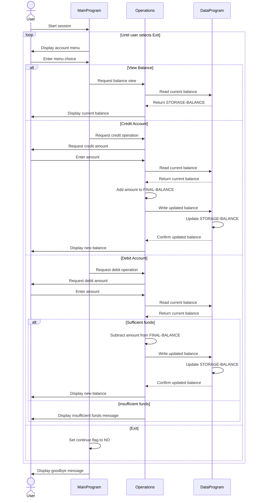
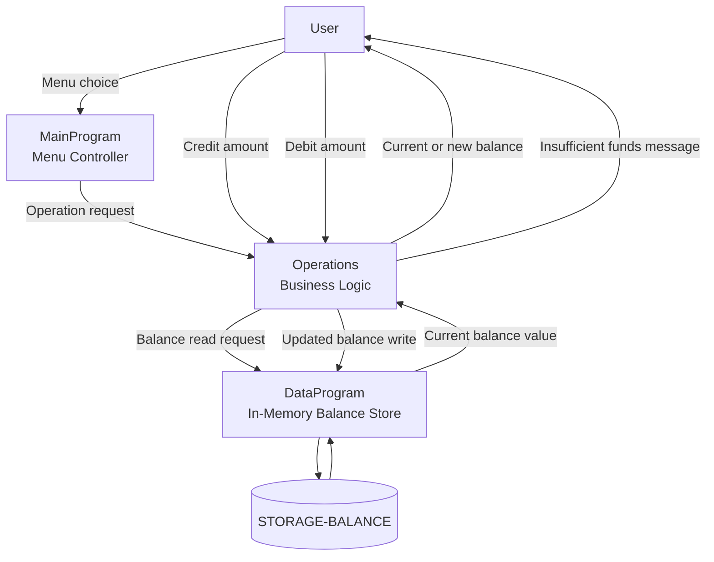

# COBOL Student Account Documentation

## Overview

This COBOL sample implements a simple account management flow that can be interpreted as a student account balance system. The application is split into three programs:

- `MainProgram` presents the menu and routes user actions.
- `Operations` applies the requested account action.
- `DataProgram` stores and returns the current balance.

The current design manages a single shared balance in memory. There is no student identifier, account number, or persistent storage, so every operation applies to one active account balance for the lifetime of the program run.

## File Purposes

### `src/cobol/main.cob`

Purpose:
Drives the interactive command-line menu for the account management system.

Key logic:

- Displays the main menu in a loop.
- Accepts a numeric user choice from 1 to 4.
- Calls `Operations` with one of these operation codes:
  - `TOTAL ` to view the balance
  - `CREDIT` to add funds
  - `DEBIT ` to subtract funds
- Ends the session when the user selects option 4.

Role in the system:
This file acts as the controller for the application. It does not calculate balances directly; it only collects the user request and delegates the actual business operation.

### `src/cobol/operations.cob`

Purpose:
Contains the transaction logic for reading, crediting, and debiting the account balance.

Key logic:

- Receives an operation code through the linkage section.
- For `TOTAL `:
  - Calls `DataProgram` with `READ`
  - Displays the current balance
- For `CREDIT`:
  - Prompts for a credit amount
  - Reads the current balance from `DataProgram`
  - Adds the entered amount
  - Writes the updated balance back through `DataProgram`
  - Displays the new balance
- For `DEBIT `:
  - Prompts for a debit amount
  - Reads the current balance from `DataProgram`
  - Verifies that the balance is sufficient
  - Subtracts the amount only when funds are available
  - Writes the updated balance back through `DataProgram`
  - Displays an insufficient-funds message when the debit cannot be applied

Role in the system:
This file contains the main business behavior. It is the only program that changes the balance and the place where balance validation is enforced.

### `src/cobol/data.cob`

Purpose:
Provides a minimal in-memory data layer for the account balance.

Key logic:

- Maintains `STORAGE-BALANCE` in working storage.
- For `READ`:
  - Copies `STORAGE-BALANCE` into the passed balance field
- For `WRITE`:
  - Copies the passed balance field into `STORAGE-BALANCE`

Role in the system:
This file abstracts balance access behind a small read/write interface. It behaves like a simple repository, but only while the process is running.

## Program Flow

1. The user selects an action in `main.cob`.
2. `main.cob` calls `Operations` with an operation code.
3. `operations.cob` reads the current balance from `DataProgram`.
4. If needed, `operations.cob` updates the balance.
5. `operations.cob` writes the new balance back through `DataProgram`.
6. Control returns to the menu.

## Business Rules For Student Accounts

Based on the current implementation, these are the effective business rules for student accounts:

- Each session starts with a default balance of `1000.00`.
- The system manages only one account balance at a time.
- Viewing the account balance does not modify the balance.
- A credit operation increases the balance by the entered amount.
- A debit operation decreases the balance only when the current balance is greater than or equal to the requested amount.
- Overdrafts are not allowed.
- If funds are insufficient, the balance remains unchanged.
- Balance changes are stored only in memory and are lost when the program ends.

## Current Limitations

If this is intended to represent real student accounts, several business concepts are not yet modeled:

- No student ID or account lookup
- No support for multiple student accounts
- No transaction history or audit trail
- No distinction between payment, refund, fee, or scholarship transactions
- No validation against negative or zero input amounts
- No persistent storage across runs

These gaps are important because the current code behaves more like a single-session balance demo than a full student account system.

## Sequence Diagram

## Data Flow Diagram

